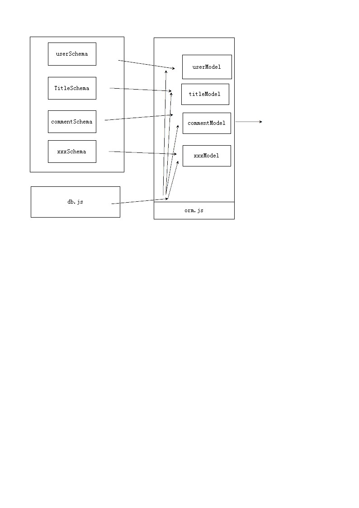

#### mongoose教程
#### mongoose连接数据库有两种方案第一种为使用connect连接，特点如下：
+ 项目只是用一个数据库
+ 此种连接方式没有返回值
+ 连接对象需要使用mongoose.connection来获取
+ 也可以直接使用mongoose来作为连接对象
~~~
var mongoose = require('mongoose');
 mongoose.connect('mongodb://localhost:27017/myapp96', { useNewUrlParser: true },function(){
    console.log("pk")
})
var db = mongoose.connection;
~~~

#### 另外一种连接方式使用createConnection连接：
~~~
var mongoose = require('mongoose');
var db       = mongoose.createConnection('mongodb://127.0.0.1:27017/myapp96',{ useNewUrlParser: true }); 

~~~
#### 特点如下：
+ 此种连接有返回值,其返回值即连接对象
+ 此种连接方式适合项目使用多个数据库

#### 相比较于mysql来说,mongoose不需要建立表了，但是需要建立模型。
+ 建立模型需要用到mongoose.schema 方法;
+ 建立完模型用model方法和数据库中的表关联;  
+ mysql使用时需要建立表,操作数据时需要用连接对象执行sql语句，
+ mongoose则可以直接操作模型或者数据实例;

#### mongoose 新增一条数据的方法有如下几种：
+ Model.create(数据对象,回调函数)
+ let newdata = new model(); newdata.save(回调函数)；
+ 插入大量数据,insertMany
代码如下:
~~~
// 增加数据的第一种方式
TestModel.create({age:"18"},(err,result)=>{
    console.log(err.message);
    console.log(result)
})
// 第二种方式:
var newTestModel = new TestModel({
    name:"张三",
    age:'24'
})
newTestModel.save((err,result)=>{
    console.log(err);
    console.log(result)
})

// 第三种方式,插入大量数据
TestModel.insertMany([
    {name:'李四1',age:'23'},
    {name:'李四2',age:'23'},
    {name:'李四3',age:'23'},
    {name:'李四4',age:'23'},
    {name:'李四5',age:'23'},
],(err,result)=>{
    console.log(err);
    console.log(result)
})
~~~

这两种方式的区别:(待定);
+ 第二种相较于第一种先生成数据的id,然后在存储
+ 不知道这两种是否都会触发钩子函数 都会触发 save的生命周期函数
    + **第一种和第二种都会触发save的钩子函数**。
    + **注意　create和save都会触发 pre('save') 而 insertMany不会触发;**
+ 第三种适合插入大量数据，会触发insertMany钩子函数

#### 查询数据有如下几种方式:

+ 直接查询

~~~
model.find({}, callback);

 model.find({},field,callback);
过滤查询,参数2: {‘name’:1, ‘age’:0} 查询文档的返回结果包含name , 不包含age.(_id默认是1)

 model.find({},null,{limit:20});
过滤查询,参数3: 游标操作 limit限制返回结果数量为20个,如不足20个则返回所有.

 model.findOne({}, callback);
查询找到的第一个文档

 model.findById(‘obj._id’, callback);
查询找到的第一个文档,同上. 但是只接受 __id 的值查询
~~~

#### find查询的时候可以设置如下参数：
+ 第一个参数 是查询条件是一个对象
   * 查询条件还可以有很多配置：**MyModel.find({ name: 'john', age: { $gte: 18 }});**
   * 
+ 第二个参数 是查询结果返回的字段,可以是个字符串，也可以是一个对象：
  > query.select({ a: 1, b: 1 });
  > query.select({ c: 0, d: 0 });
  > query.select('a b');
  > exclude c and d, include other fields
  > query.select('-c -d');
+ 第三个参数 设置查询结果的返回条件;常用的如limit skip sort 
+ 第四个参数 为回调函数;

#### findOne与findById使用注意事项：
+ findById(id)等价于findOne({ _id: id })
+ findOne(undefined)、findOne({ _id: undefined })等价于 findOne({}),返回任意一条数据.
+ findById(undefined) 等价于 findOne({ _id: null })

#### 关联文档 population的使用,**populate(关联))**
+ 第一个引用字段的名称,多个用空格分隔
+ select: 填充引用 document 中的哪些字段
  ~~~
    TestModel.find({}).populate("user",{name:1,_id:0}).then((data)=>{
        console.log(data)
    })
  ~~~
+ 

#### 如何构建合理的构建模型,如图：这样做可以很好的规避关系文档的引用错误;

**这样生成模型的动作全部在一个文件中生成,不会出现引用错误**
**这样做是为了A模型关联B模型的时候，确保B模型已经存在了，就是已经声明过了**

#### 生命周期钩子函数
#### pre 和 post的区别
+ pre在数据库执行动作之前,对数据进行数据库操作之前。
+ post在数据库执行动作之后,在post中拿到的数据，是在数据库动作操作完成之后。
~~~
TestSchema.pre('save',(next)=>{
    console.log("pre-save")
    next()
})
TestSchema.post('save',(next)=>{
    console.log("post-save")
    console.log("next",next);
    next.name = "123";
})

~~~

#### 执行顺序为
+ 1、先执行pre的函数;
+ 2、然后进行存储动作;（过程不可见）
+ 3、存储完成后执行post的回调;
+ 4、执行save的回调,此时回调的结果已经被post处理过;
#### 应用场景
 pre用户注册存储密码加密后存储;post 查询用户,查询完成后设置一些属性;

